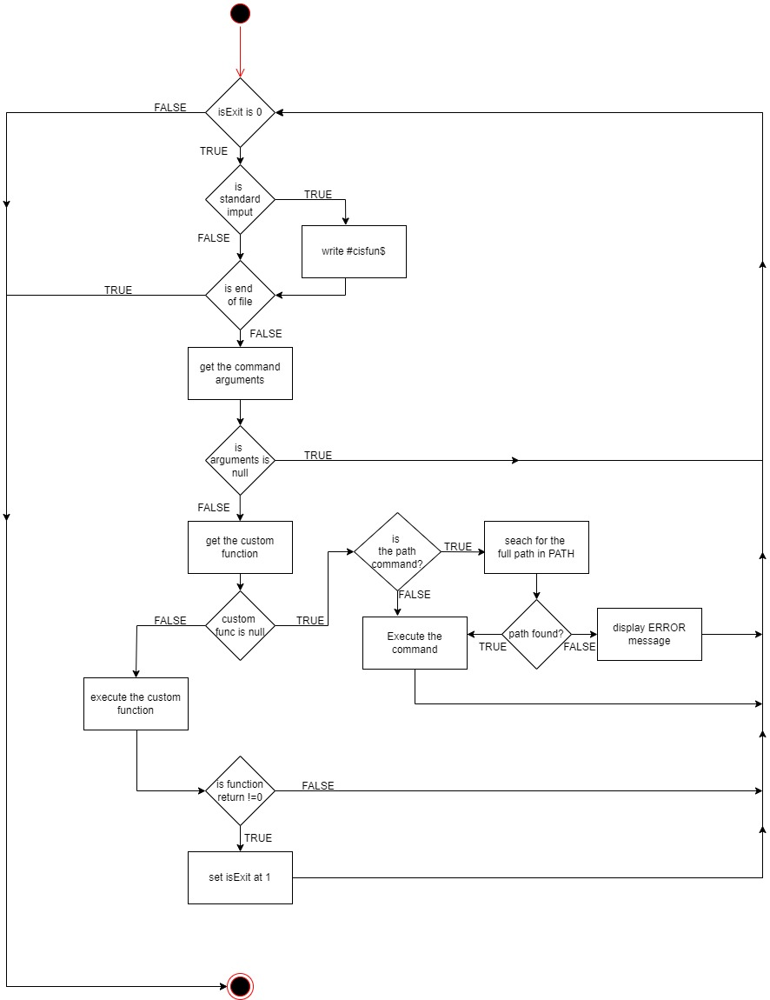

# SIMPLE SHELL

## Description

**Simple shell** shell is a command-line interpreter developed in C.
It translates user-typed commands into instructions understandable by the operating system.
The shell facilitates interaction with the system and execution of programs through a textual interface.

The shell serves as a user interface for interacting with an operating system. It allows users to execute commands, run scripts, manage files and directories, manipulate system settings, and perform various other tasks directly from the command line. Additionally, it enables automation through scripting, making it a powerful tool for system administrators, developers, and power users.

## Man page
The man page is a file wich explains in detail how Simple Shell works. If you want see a full explanation of this function you can run our man page this way:
[le lien vers le man]

## Flowchart

## List of  mantory tasks

0. **README, man, AUTHORS :** Write a README . Write a man for your shell. You should have an AUTHORS file at the root of your repository, listing all individuals having contributed content to the repository.
1. **Betty would be proud :** Write a beautiful code that passes the Betty checks.
2. **Simple shell 0.1 :** Write a UNIX command line interpreter.
3. **Simple shell 0.2 :** Simple shell 0.1 + Handle command lines with arguments.
4. **Simple shell 0.3 :** Simple shell 0.2 + Handle the PATH + fork must not be called if the command doesn’t exist.
5. **Simple shell 0.4 :** Simple shell 0.3 + Implement the exit built-in, that exits the shell + Usage: exit + You don’t have to handle any argument to the built-in exit.
6. **Simple shell 1.0 :** Simple shell 0.4 + Implement the env built-in, that prints the current environment.

## List of advanced tasks

7. **What happens when you type `ls -l *.c` in the shell :** Write a blog post describing step by step what happens when you type `ls -l *.c` and hit Enter in a shell. Try to explain every step you know of, going in as much details as you can, give examples and draw diagrams when needed. You should merge your previous knowledge of the shell with the specifics of how it works under the hoods (including syscalls).
8. **Test suite :** Contribute to a test suite for your shell.
9. **Simple shell 0.1.1 :** Simple shell 0.1 + Write your own getline function + Use a buffer to read many chars at once and call the least possible the read system call + You will need to use static variables + You are not allowed to use getline.
10. **Simple shell 0.2.1 :** Simple shell 0.2 + You are not allowed to use strtok.
11. **Simple shell 0.4.1 :** Simple shell 0.4 + handle arguments for the built-in exit + Usage: exit status, where status is an integer used to exit the shell.
12. **Simple shell 0.4.2 :** Simple shell 0.4 + Handle Ctrl+C: your shell should not quit when the user inputs ^C.
13. **setenv, unsetenv :** Simple shell 1.0 + Implement the setenv and unsetenv builtin commands.
14. **cd :** Simple shell 1.0 + Implement the builtin command cd.
15. **; :** Simple shell 1.0 + Handle the commands separator ;.
16. **&& and || :** Simple shell 1.0 + Handle the && and || shell logical operators.
17. **Alias :** Simple shell 1.0 + Implement the alias builtin command.
18. **Variables :** Simple shell 1.0 + Handle variables replacement + Handle the $? variable + Handle the $$ variable.
19. **Comments :** Simple shell 1.0 + Handle comments (#).
20. **Help :** Simple shell 1.0 + Implement the help built-in.
21. **History :** Simple shell 1.0 + Implement the history built-in, without any argument.
22. **File as input :** Simple shell 1.0 + Your shell can take a file as a command line argument + The file contains all the commands that your shell should run before exiting + The file should contain one command per line + In this mode, the shell should not print a prompt and should not read from stdin.

## USAGE INSTRUCTIONS

### Compilation commands
- To compile the program this command has to be executed:
`gcc -Wall -Werror -Wextra -pedantic -std=gnu89 *.c -o hsh`
- To run the shell is like this:
`$ ./hsh`

### Testing

**Interactive mode**
[present dans la consigne, a copier]

**Non interactive mode**
[present dans la consigne, a copier]

### Checks

**Coding Style**
Betty style for both coding and documentation.

## Technologies

- **Environment :** Ubuntu 20.04 LTS.
- **development environment :** Visual Studio Code with Windows 11, compiled with Ubuntu on WSL
- **framework :** C programm & libraries : stdio ; stdlib ; unistd ; sys/wait ; sys/types.

## REQUIREMENTS

- **Allowed editors :** vi, vim, emacs
- All your files will be compiled on Ubuntu 20.04 LTS using gcc, using the options `-Wall -Werror -Wextra -pedantic -std=gnu89`
- All your files should end with a new line
- A README.md file, at the root of the folder of the project is mandatory
- Your code should use the Betty style. It will be checked using betty-style.pl and betty-doc.pl
- Your shell should not have any memory leaks
- No more than 5 functions per file
- All your header files should be include guarded
- Use system calls only when you need to.

**Allowed functions used**
- all functions from string.h
- access (man 2 access)
- chdir (man 2 chdir)
- close (man 2 close)
- closedir (man 3 closedir)
- execve (man 2 execve)
- exit (man 3 exit)
- _exit (man 2 _exit)
- fflush (man 3 fflush)
- fork (man 2 fork)
- free (man 3 free)
- getcwd (man 3 getcwd)
- getline (man 3 getline)
- getpid (man 2 getpid)
- isatty (man 3 isatty)
- kill (man 2 kill)
- malloc (man 3 malloc)
- open (man 2 open)
- opendir (man 3 opendir)
- perror (man 3 perror)
- printf (man 3 printf)
- fprintf (man 3 fprintf)
- vfprintf (man 3 vfprintf)
- sprintf (man 3 sprintf)
- putchar (man 3 putchar)
- read (man 2 read)
- readdir (man 3 readdir)
- signal (man 2 signal)
- stat (__xstat) (man 2 stat)
- lstat (__lxstat) (man 2 lstat)
- fstat (__fxstat) (man 2 fstat)
- strtok (man 3 strtok)
- wait (man 2 wait)
- waitpid (man 2 waitpid)
- wait3 (man 2 wait3)
- wait4 (man 2 wait4)
- write (man 2 write)

## CONTRIBUTIONS

- [Antonin NOYELLE](https://github.com/Ninotna) - Initial work & contributions.
- [Charlène SCOMPARIN](https://github.com/ChSPN) - Initial work & contributions.
